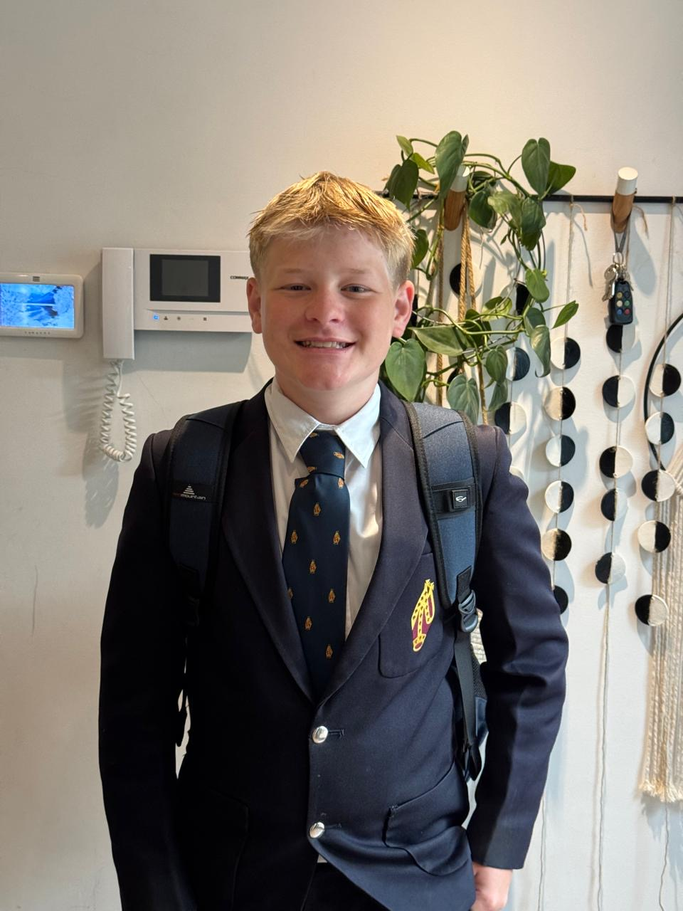
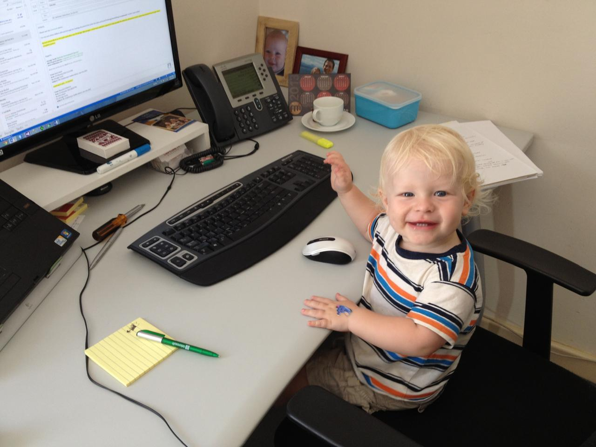
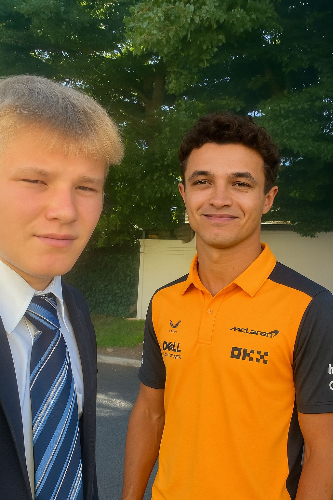
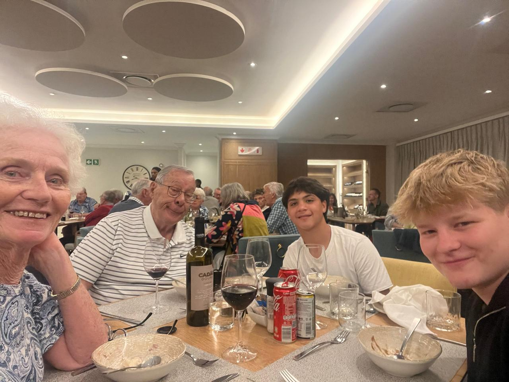

<!DOCTYPE html>
<html lang="en">
<head>
  <meta charset="UTF-8">
  <meta name="viewport" content="width=device-width, initial-scale=1.0">
  <title>Nicholas Turck | Big Ideas 2026</title>
  <link rel="preconnect" href="https://fonts.googleapis.com">
  <link href="https://fonts.googleapis.com/css2?family=Playfair+Display:ital,wght@0,400;0,700;0,900;1,400;1,700&family=DM+Sans:opsz,wght@9..40,300;9..40,400;9..40,500&display=swap" rel="stylesheet">
  
</head>
<body>

  <header>
    
Nicholas Turck

    <nav>
      <a href="#qualities">Qualities</a>
      <a href="#hobbies">Hobbies</a>
      <a href="#skills">Skills</a>
      <a href="#why">Why Big Ideas</a>
    </nav>
  </header>

  <!-- ═══ HERO ═══ -->
  <section class="hero">
    

      
Big Ideas Programme · 2026 Application

      <h1>Discipline. <em>Initiative.</em> Collaboration.</h1>
      
I'm Nicholas — a Grade 9 student from Cape Town who trains MMA five days a week, builds websites for real clients, and spends his evenings pushing the limits of what AI tools can do. I believe in showing up, taking ownership, and doing the work even when it's hard. These are the qualities I'm bringing to Big Ideas 2026.

      

        <a href="#qualities" class="btn-dark">Explore My Profile</a>
        <a href="#why" class="btn-link">Why Big Ideas fits me →</a>
      

    

    

      <!-- Nicholas in school uniform — personal photo -->
      
      

      

        
14

        
Years old · Cape Town

      

      
Grade 9

    

  </section>

  <!-- ═══ QUALITIES ═══ -->
  <section id="qualities" class="s">
    

      

        

          
Who I Am

          <h2 class="title">Qualities I bring to the <em>table</em></h2>
          
These aren't things I chose because they sound good in an application. They're qualities I've had to actually develop — through early mornings, hard training sessions, real client deadlines, and moments where quitting would have been much easier. Every single one of them has been tested and earned over time.

        

        

          

            
01

            <h3>Proactive & Self-Starting</h3>
            
I've never been someone who waits around for things to happen. When I see a gap or spot an opportunity, my instinct is to go after it. Starting a web development business at 14 wasn't something anyone suggested to me — I just realised I could do it and started doing it. That bias toward action is something I carry into everything: school, training, and projects I genuinely care about.

          

          

            
02

            <h3>Resilient & Calm Under Pressure</h3>
            
MMA has a way of teaching you what you're actually made of. When you're completely exhausted and still expected to perform, you quickly learn whether your mindset holds up or falls apart. Mine holds up. I've got a lot of practice staying composed when things get uncomfortable — and that same calmness shows up in how I handle pressure in schoolwork, deadlines, and anything that feels genuinely high-stakes.

          

          

            
03

            <h3>Consistent, No Matter What</h3>
            
I think consistency is one of the most underrated qualities a person can have. Motivation comes and goes — what matters is whether you show up anyway. I've built habits around training, client communication, and studying that don't depend on how I'm feeling that day. I'm the kind of person you can count on to still be there, still doing the work, a month from now.

          

        

      

    

  </section>

  <!-- ═══ HOBBIES ═══ -->
  <section id="hobbies" class="s">
    

      

        

          
What I Do

          <h2 class="title">Hobbies & <em>Passions</em></h2>
        

        
These aren't just ways I fill time. Each of these activities has genuinely shaped who I am and how I think. They've pushed me in different directions and given me real, practical skills — not just interests I list on a form to sound interesting.

      

      

        <!-- MMA — personal team photo -->
        

          

            
          

          Discipline · Resilience
          

            My team at Pride Fighting Academy
            <h3>Mixed Martial Arts</h3>
            
MMA has pushed me harder than anything else in my life. It's not glamorous — it's early starts, sore muscles, and sessions where nothing clicks. But that's exactly why I keep coming back. The sport has built a kind of mental toughness in me that you genuinely can't get from a classroom. I've learned to stay calm under pressure, to trust my teammates, and to find something left in the tank when I'm convinced there's nothing there. Everything I've built on the mat I carry into real life.

          

        

        <!-- Web Dev — baby-at-computer personal photo -->
        

          

            
          

          Initiative · Real-World
          

            I've always been good with computers
            <h3>Web Development & Running a Small Business</h3>
            
At 14, I build websites for actual paying clients. That means managing expectations, hitting deadlines, explaining technical things in plain English, and standing behind my work when something goes wrong. It's taught me more about professional responsibility than anything else I've done. I also genuinely enjoy the craft — the logic of clean code, the satisfaction of solving a problem elegantly, and the moment a client sees something I built and loves it.

          

        

        <!-- AI — Nicholas meeting Lando Norris via AI -->
        

          

            
          

          Curiosity · Innovation
          

            My attempt to meet Lando Norris using AI
            <h3>Exploring Artificial Intelligence</h3>
            
I've been curious about AI since before it became a buzzword — and yes, I've already used it to make things happen that probably wouldn't have otherwise. I spend real time experimenting with different tools, testing their limits, and thinking critically about how they actually work. I use AI to think through complex problems, organise messy ideas, and ask better questions. I'm just as interested in what it can't do, and in what all of this means for the future.

          

        

      

    

  </section>

  <!-- ═══ SKILLS ═══ -->
  <section id="skills" class="s">
    

      

        

          
What I Bring

          <h2 class="title">Skills & <em>Strengths</em></h2>
          
None of these came from a course or a textbook. They came from doing real things — managing actual client projects, keeping up a training schedule that doesn't let you off the hook, and caring enough about my work to do it properly every single time. These are practical strengths that show up in how I work with others and how I tackle problems under pressure.

        

        

          

            🛠
            <h3>Practical Problem Solving</h3>
            
I approach problems methodically and without panicking. Whether it's a broken website the night before a client deadline, a tough moment in training, or a confusing assignment — I slow down, think it through, and work toward a solution. I've learned that most problems look much worse than they actually are if you take them apart carefully and stay calm while you do it.

          

          

            💬
            <h3>Clear Communication</h3>
            
Working with real clients has made me far more thoughtful about how I communicate than most people my age. I've had to explain technical things simply, set expectations carefully, and make sure nothing important gets lost between two people with very different levels of knowledge. I've got good instincts for what someone actually needs — not just what they're literally asking for.

          

          

            ⏱
            <h3>Time Management & Ownership</h3>
            
Fitting five-plus days of training a week, client work, and full-time school into the same schedule forces you to be serious about how you manage your time and energy. I've had to make real trade-offs and stay accountable when nobody's checking on me. I take ownership of my commitments — not because I have to, but because that's the kind of person I want to be.

          

          

            🤝
            <h3>Being a Reliable Team Member</h3>
            
In MMA and in group school projects, I've learned that a team is only as strong as its least reliable member. I actively try to fill gaps, notice when someone's struggling, and add energy to a group rather than drain it. Reliability genuinely matters to me — I don't want to be the person others have to chase up or work around. I'd rather be the one doing the carrying.

          

        

      

    

  </section>

  <!-- ═══ WHY BIG IDEAS ═══ -->
  <section id="why" class="s">
    

      

        
The Bigger Picture

        <h2 class="title light">Why <em>Big Ideas</em> fits me</h2>
      

      

        

          

            <h3>Real-World Challenges</h3>
            
I do my best work when the stakes are actual. When there's a real problem on the table — something that affects real people and needs genuine thinking to solve — I become a different kind of student. I've found that meaningful work pulls out abilities in me that comfortable, low-stakes tasks simply don't reach. Big Ideas feels built around exactly that kind of challenge, and I want to be in the room where it happens.

          

          

            <h3>Connecting Ideas Across Fields</h3>
            
The thing I find most exciting about the intersection of technology, creativity, and real-world problem solving is that the connections always surprise you. I naturally look for patterns across different areas — how design thinking applies to training structure, how what I've learned about AI reshapes how I approach almost everything else. Big Ideas is built for that kind of cross-disciplinary curiosity, and it's where I naturally thrive.

          

          

            <h3>A Collaborative Environment</h3>
            
The best moments I've had — in the gym, in client work, in group school projects — all came from working alongside people who genuinely pushed each other toward something better. I love being part of a team where everyone wants the whole group to succeed. I bring honesty, energy, and real reliability to that dynamic. I'm not afraid to challenge an idea when I think it matters — and I can take the same honest pushback in return.

          

          

            <h3>Growing Into Someone Bigger</h3>
            
I'm 14 and I'm already clear on the kind of person I want to become: someone who builds meaningful things, thinks critically, works hard without being told to, and actually makes a difference. Big Ideas 2026 feels like the kind of experience that doesn't just add a line to a CV — it genuinely shapes who you are. That's what I'm looking for, and what I'm ready to give everything to.

          

        

        <!-- Right column: stacked why cards visual filler with dark aesthetic text -->
        

          

            
2026

            
Big Ideas Cohort

          

          

            
"I'm excited to bring my discipline, curiosity, and genuine drive to Big Ideas — and to be part of something that actually matters."

            
— Nicholas Turck

          

          

            

              

                
5+

                
Days training/week

              

              

              

                
9

                
Grade

              

              

              

                
14

                
Years old

              

            

          

        

      

    

  </section>

  <!-- ═══ PERSONAL PHOTOS ═══ -->
  <section class="photos-strip">
    

      
A Glimpse of My Life

      

        <!-- Tall left: grandparents dinner -->
        

          
          

            <strong>Family</strong>
            Me with my grandparents and cousin at dinner
          

        

        <!-- Right column: grade 8 photo stacked -->
        

          

            
            

              <strong>September 2024</strong>
              My first day in Grade 8
            

          

          <!-- Dark stat card -->
          

            
Cape Town, South Africa

            
Grade 9 · Big Ideas Applicant · 2026

            
MMA athlete · Web developer AI explorer · Cape Town

          

        

      

    

  </section>

  <!-- ═══ FOOTER ═══ -->
  <footer>
    
Nicholas Turck

    

      
Grade 9 · Cape Town, South Africa

      
Big Ideas 2026 Application

    

  </footer>

  

</body>
</html>
